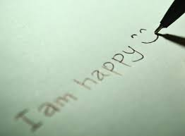

# Applied Data Science @ Columbia
## Fall 2023
## Project 1: What made you happy today?



### [Project Description](doc/Proj1_desc.md)
This is the first and only *individual* (as opposed to *team*) this semester. 

Term: Fall 2023

+ Projec title: Happy story of HappyDB
+ This project is conducted by Shaohuan Wu

+ Project summary: [a short summary] This project presents a statistical story of happy moments. HappyDB is a corpus of 100,000 crowd-sourced happy moments via Amazon’s Mechanical Turk. In this project, I would process and clean the HappyDB data and then do something interesting, such as generate word cloud to show that nowadays which thing is happiness for people, and use TFIDF value (Term Frequency-Inverse Document Frequency) to select and specify their own unique words for all ages groups.

Following [suggestions](http://nicercode.github.io/blog/2013-04-05-projects/) by [RICH FITZJOHN](http://nicercode.github.io/about/#Team) (@richfitz). This folder is orgarnized as follows.

```
proj/
├── lib/
├── data/
├── doc/
├── figs/
└── output/
```

Please see each subfolder for a README file.
